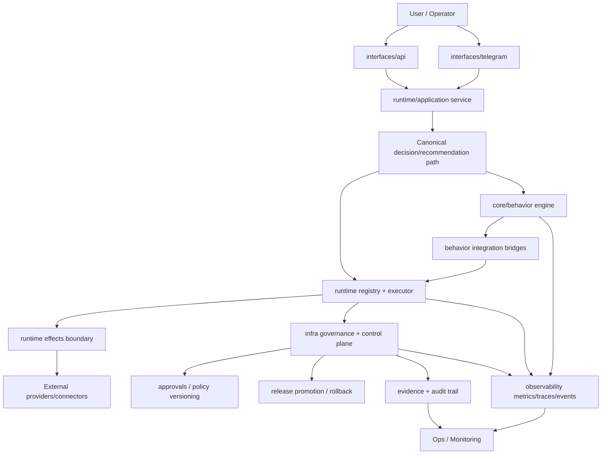

# PROJECT_FLOW_V1

## Notes

- Interfaces stay thin and call application contracts only.
- Decision intent is generated in canonical path; execution is isolated in runtime effects.
- Governance and compliance can gate, approve, rollback, and record evidence.
- Behavior engine enriches constraints/observables without creating a second brain.
